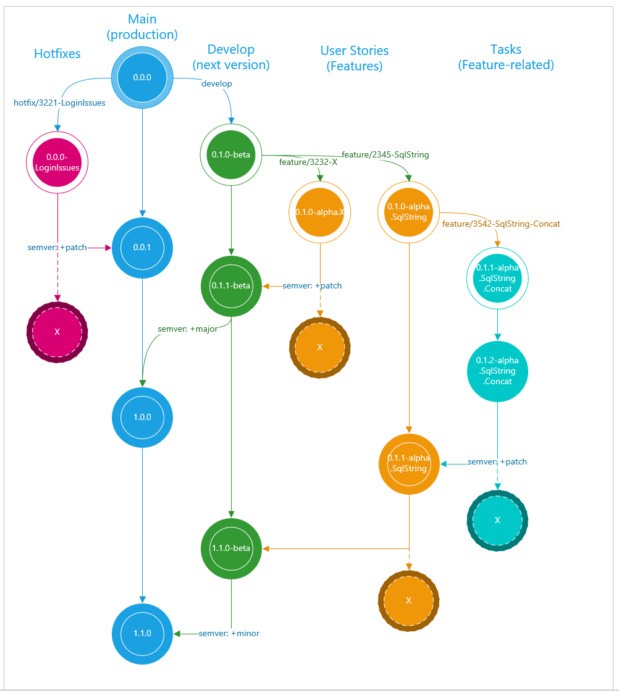

# Contributing Guidelines

1. Always work on a feature/\<ISSUE-Number\>-description branch such as ```feature/1-manyToManyScaffold``` for issue [#1](/../../issues/1)
2. Feature branches are *ALWAYS* based on ```develop``` and are *ONLY* merged back to develop
3. Always pull latest changes from ```develop``` to your own branch before starting any work

For a sample of how branches interact with each other and are tagged with versions, consult the following graph.

 
Copyright © Kritikos IO 2021